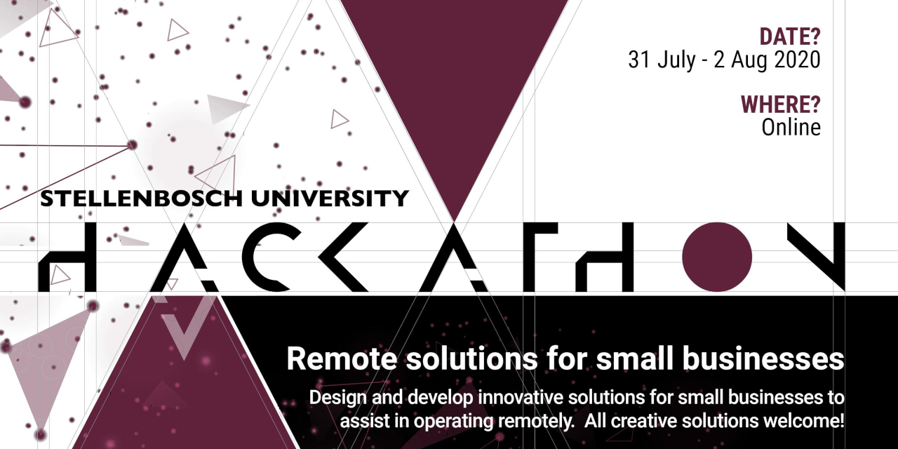

# Welcome to the 2020 Stellenbosch University Data Science Challenge

For this year's challenge we want you to build solutions that can help small businesses to function effectively in the new normal post-COVID. Think outside the box, i.e. don't just emulate existing solutions, but rather try to think of the challenges that small businesses face that no one is solving yet. 

This means identifying ways through which data can be used to provide actionable insights to businesses. Teams will be required to supplement the available data from small businesses with additional open source datasets (e.g. weather, traffic, and relevant location based services such as ATM’s) to build out specific insights for the small businesses. 

This year the entire event will be run remotely on MS Teams. As always business & technology mentors will be available from the sponsors to assist you. Please make use of their expertise.

The data science challenge starts as soon as the data is available (07-07-2020) and runs until the end of the hackathon, Sunday morning the 2nd of August. This means you have just over three weeks to work on the data, generate ideas and come up with innovative ideas around using data to support small businesses. 

There will be two separate session on Sunday where you will pitch your solution to a panel of judges via a MS Team video call.

The rest of this guide sets out everything you need to know about the event.

1. [Judging Criteria](#1-judging-criteria)
2. [Pitching Tips](#2-pitching-and-general-tips)
3. [Data](#3-data)
4. [Additional Info](#4-additional-info)

## 1. Judging Criteria

The judges will subjectively evaluate all the pitches using the following criteria.

Criteria | Description
-------- | -----------
**Concept** | Did the group come up with a good solution to the initial problem or challenge? Did they understand and research the problem? Do they understand their end user's needs?
**Creativity** | How creative has the group been in solving the challenge? Did they come up with a radical approach, or did they follow existing patterns and solutions? Is this a differentiated idea in some way?
**Supplementary Data** | Did the group combine the provided data with interesting new data sources and create value outside of the basic data provided?
**Data Science/Machine Learning application** | Did the group come up with a useful model that provides insights to the business? This model needs to be data driven, but is not limited to pure machine learning applications (Model can also describe a system or a process).
**Business Model / Impact** | Is the idea feasible, does it have economic and societal value, and is it sustainable? If a small business used their data in this way, would it unlock new value and improve the business?

**Note:** All decisions are final and will not be open to discussion.

## 2. Pitching and General Tips

From previous events we'd like to offer you the following tips:

* You'll have 7 minutes to pitch your solution to the judges, in that time it is your responsibility to give them enough info as per the above criteria to evaluate your solution.

* The judges will have 3 minutes to ask you clarifying questions, be brief and to the point in your answers.

* Don't just focus on a pure machine learning approach. Think though the business value that you will generate by unlocking insights from data, and whether or not that will ultimately improve a business.

* Don't wait until the weekend before working through the data, and don't code until the last minute. Rather reduce your scope to make time to practice your presentation.

* Take time to research the business and industry to get an idea of typical business problems and how understanding data would help to address these. 

* Data are not is. The word data is a plural noun so write "data are". Datum is the singular. Generally real-world data are messy and you can expect to find some issues with the dataset, even though basic pre-cleaning has been applied. 

* A pitching workshop will be held before the event, please do make use of this to develop your skills.

* Remember to have fun and use the opportunity to build your networks. 

## 3. Data

* The data provided contains three months worth of card transactions from different small businesses. Since people can pay through other means this isn't a full view of the business. 

* Different types of businesses from different areas of the country was selected to provide different avenues of exploration.

* Some basic client demographics has been provided for some food for thought, this will only be available for Capitec clients that use the business. 

* Since a very limited view of a business is shared (limited fields), it is up to you to enhance with additional data sources you can find.

* The specific businesses cannot be shared, but since the area code is shared you could tag any known business in the town/city if you want to use specific geolocation data. 

## 4. Additional Info

* An ask the expert session is planned, details to be shared at a later stage, watch this space. 